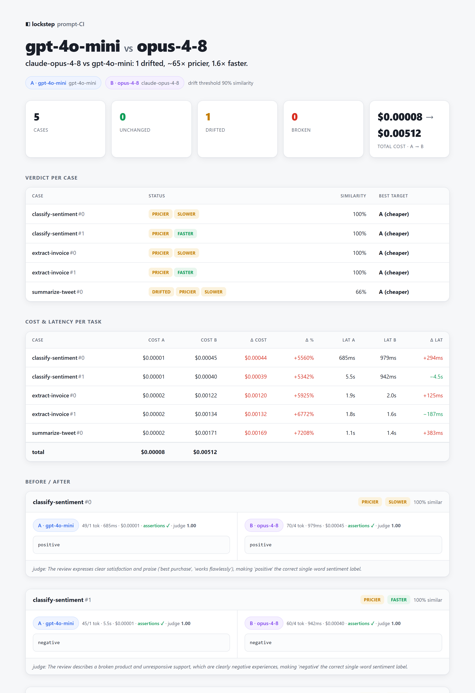

<div align="center">

# Lockstep

**Prompt regression testing for the model-churn era.**

Replay your real prompts across models and providers, then see exactly what
changed in the output — and what it now costs — in one shareable report.

[](https://github.com/arwenizEr/lockstep/actions/workflows/ci.yml)
&nbsp;[](LICENSE)
&nbsp;

`npx lockstep run` · `npx lockstep compare` · `npx lockstep report`

[Why](#why) · [Quickstart](#quickstart) · [Commands](#commands) · [Architecture](ARCHITECTURE.md)

</div>

---

[](examples/sample-report.html)

<div align="center"><sub>The report is one self-contained HTML file. <a href="examples/sample-report.html">Open the live sample →</a></sub></div>

---

> Free and open source ([MIT](LICENSE)). No accounts, no cloud, no telemetry — it
> runs entirely on your machine.

## Why

Every model release quietly re-tunes three things at once: **behaviour, cost, and
accepted parameters.** You bump the model ID, and suddenly your extraction prompt
formats JSON a little differently, an effort tier means a different amount of
reasoning, the bill moves, and a sampling parameter you were sending starts
returning `400`.

The standard advice — "re-test your prompts after each release" — is a job for a
tool, not an afternoon of manual spot-checking. And because the value lies in
*neutrality* (comparing a vendor against its own past versions and against
competitors), no single vendor is going to build it for you.

Lockstep is that tool, kept deliberately small: define your prompts as test cases
once, run them against any set of models, and get a reviewable diff of output,
cost, and latency.

## How it works

1. **`run`** executes every *case × input × target* combination and records the
   output, token usage, cost, and latency to `.lockstep/runs/<timestamp>.json`.
2. **`compare`** pairs two runs case-by-case and classifies each result —
   `OK`, `DRIFTED`, `BROKEN`, `CHEAPER`, `PRICIER`, `FASTER`, or `SLOWER`.
3. **`report`** renders the comparison as a single self-contained HTML file —
   inline CSS/JS, no CDN, opens offline — with status badges, a cost-and-latency
   table, and side-by-side output panels with the text diff highlighted.

## Quickstart

```bash
# 1. Provide a key (or place it in a .env file — see .env.example)
export ANTHROPIC_API_KEY=sk-ant-...      # and/or OPENAI_API_KEY

# 2. Scaffold, run, and report
npx lockstep init && npx lockstep run && npx lockstep report
```

`init` writes `lockstep.yaml` and a `cases/` directory; `run` executes every case
against every target and saves the run; `report` renders `lockstep-report.html`.
Run it again after a model release and `report` diffs the two most recent runs.

### Try it with no API key

A built-in `mock` provider runs the entire pipeline offline and deterministically
at zero cost — useful for evaluating Lockstep or for running it in CI without
secrets. The [`examples/offline/`](examples/offline/) suite is configured this way:

```bash
cd examples/offline
npx lockstep run          # run twice to produce two comparable runs
npx lockstep run
npx lockstep compare
```

## Commands

> Full reference with example output for every command: **[docs/USAGE.md](docs/USAGE.md)**.

| Command | Description |
|---|---|
| `lockstep ask [prompt]` | Run one prompt (arg, `--file`, or stdin) against **every** target and compare side-by-side — no cases file needed. |
| `lockstep init` | Scaffold `lockstep.yaml` and `cases/example.yaml`. |
| `lockstep run` | Run every case × input × target; record output, tokens, cost, and latency to `.lockstep/runs/`. Flags: `--target <id>` (repeatable), `--concurrency <n>`, `--judge`, `--judge-model <model>`, `--junit <file>`, `--dry-run`. |
| `lockstep compare [A] [B]` | Diff two runs per case (similarity, cost/latency delta, status). Omit the paths to diff the two most recent runs. Flags: `--a-target`, `--b-target`, `--fail-on <statuses>`, `--json`. |
| `lockstep report [A] [B]` | Generate the report. Flags: `--format <html\|md>`, `-o <file>`, `--a-target`, `--b-target`, `--fail-on <statuses>`. |
| `lockstep list` | List saved runs in `.lockstep/runs/` (newest first). |

Two targets within a single run can be compared by passing the same run file
twice with `--a-target` / `--b-target`.

### Gating CI

`compare` and `report` accept `--fail-on` and exit with a non-zero status when any
listed status is present, so a prompt regression fails the build:

```bash
lockstep run --junit results.xml            # JUnit XML for the CI test view
lockstep compare --fail-on drifted,broken   # exit 1 if anything drifted or broke
```

Accepted statuses: `drifted`, `broken`, `pricier`, `slower`, `cheaper`, `faster`.
`compare --json` emits the full comparison to stdout for scripting, `run --junit`
writes a JUnit report for CI dashboards, and `report --format md` renders a
Markdown summary suitable for a pull-request comment. Use `run --dry-run` to
preview the run matrix and pricing without spending tokens.

## Defining test cases

```yaml
- id: extract-invoice
  prompt: "Extract vendor, total, and currency as JSON from: {{input}}"
  system: "Output only JSON."
  inputs:
    - "Invoice from Acme Corp — 1240.00 USD, net 30."
  assert:                       # Tier 1: deterministic, offline, free
    - { type: json_valid }
    - { type: json_has_keys, keys: [vendor, total, currency] }
  rubric: "Did it extract all three fields without hallucinating?"   # Tier 2: opt-in judge
```

Assertion types: `json_valid`, `json_has_keys`, `contains`, `not_contains`,
`icontains`, `equals`, `regex`, `max_length`, `min_length`, `json_path`.

## Drift detection, in two tiers

- **Tier 1 — default, deterministic, offline, free.** Bag-of-words cosine
  similarity, length delta, JSON validity, and your assertions. Anything below the
  configured `similarity_threshold` is flagged `DRIFTED`.
- **Tier 2 — opt-in (`--judge`), spends tokens.** A model scores each output
  against the case `rubric` (0–1 plus a one-line reason). Disabled by default so a
  plain run stays cheap.

## Cross-provider by design

Anthropic, OpenAI, and a keyless `mock` provider ship today, all behind a single
`Provider` interface. Adding another is one adapter file plus one line in
[`core/providers/registry.ts`](core/providers/registry.ts) — `config.ts` validates
the `provider` field against the registry, so the schema never needs editing.

Each adapter owns its provider's quirks: the OpenAI adapter drops the sampling
parameters a model rejects (reasoning models versus chat models) and applies a
request timeout; the Anthropic adapter maps an `effort` tier onto the
model-correct extended-thinking shape. See [ARCHITECTURE.md](ARCHITECTURE.md).

## Development

```bash
npm install
npm test           # 163 vitest tests (offline; includes a CLI smoke test, no API key required)
npm run dev -- run # run the CLI from source via tsx
npm run build      # type-check and compile to dist/
```

Prices in `lockstep.yaml` are config-driven and treated as untrusted defaults;
they change with every release, so verify them before relying on the cost figures.
Unknown models are flagged rather than silently costed at zero.

## License

[MIT](LICENSE).
